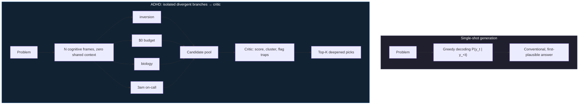

<p align="center">

# Evals for ADHD — Phase 2
### We tried to break our own result. Here's what survived.

</p>

[](https://adhdstack.github.io/) [](./LICENSE) [](./research/logs) [](./findings) [](./findings/study3_finding_reproduction.md)

---

## The pitch, in one paragraph

v0.1 of [ADHD](https://github.com/UditAkhourii/adhd) showed a 5/6 win over single-shot prompting — judged by a model from the same family as the generator, on six hand-picked engineering problems. That's a demo, not evidence. So Phase 2 stress-tests the actual claim: swap the judge, leave engineering entirely, and — the sharpest test we could design — **hand the harness only what was known *before* a real scientific discovery, strip every name and term that could leak the answer, and see if the candidate pool contains it.** Every number below links straight to the JSON that produced it, and every JSON is backed by raw, append-only LLM call logs. Nothing here is asserted without a file you can open.

---

## Headline result: can it find things nobody told it?

Given only a genericized pre-discovery prompt — no paper titles, no drug names, no jargon — for 9 real published discoveries in systems engineering, medicine, and biology:

| Contamination risk | Cases | ADHD (hit + partial) | Baseline (hit + partial) |
| --- | ---: | ---: | ---: |
| **Post-cutoff (low risk of memorization)** | 5 | **5 / 5** | 5 / 5 |
| **Pre-cutoff (higher risk)** | 4 | **3 / 4** | 4 / 4 |
| **All cases** | 9 | **8 / 9** (5 hit, 3 partial, 1 miss) | 9 / 9 |

| Case | Domain | Discovery | ADHD result | Rank in pool | Frame that found it |
| --- | --- | --- | --- | ---: | --- |
| `simd_json` | Engineering | Vectorized JSON parsing (simdjson) | **HIT** | 25 / 30 | `ten-year-old` |
| `glp1_addiction` | Health | GLP-1 mesolimbic reward attenuation | **HIT** | 22 / 30 | `inversion` |
| `metformin_longevity` | Health | AMPK / mTORC1 nutrient-sensing axis | **HIT** | 19 / 30 | `biology` |
| `statins_sepsis` | Health | eNOS / Rho-kinase endothelial stabilization | **HIT** | 13 / 30 | `regulator` |
| `raft` | Engineering | Raft consensus (log replication) | PARTIAL | 5 / 30 | `inversion` |
| `crispr` | Biology | CRISPR adaptive immunity | PARTIAL | 22 / 30 | `markets` |
| `evoformer` | Biology | AlphaFold 2 axial attention | PARTIAL | 1 / 30 | `adversary` |
| `mrna_lnp` | Biology | mRNA lipid nanoparticle delivery | PARTIAL | 12 / 30 | `speedrunner` |
| `chandy_lamport` | Engineering | Distributed snapshot algorithm | **MISS** | — | — |

**Small N, and we say so.** This is 9 cases, not 900 — treat it as a promising early result on a genuinely new evaluation method, not a settled law. What earns it a place on this page is that it's the one study in this whole project with an answer that isn't another LLM's opinion — it's checkable against the literature, case by case, above.

**The twist worth remembering:** on several hits, the correct idea was sitting in the pool at rank 12–25 out of 30 — meaning the harness generated the right answer and its own critic pass nearly buried it. That's the actual engineering finding here, and it's going straight into v0.2.

Full case-by-case reasoning: [`findings/study3_finding_reproduction.md`](./findings/study3_finding_reproduction.md) · Raw data: [`findings/finding_reproduction.json`](./findings/finding_reproduction.json)

---

## The shape of the win, everywhere we looked

Same pattern, every study, every judge, every domain: ADHD dominates on breadth/novelty/trap-detection and loses on immediate actionability. That's not noise — it's the architecture's actual trade-off, and it held under a judge swap and three unrelated domains.

### Study 1 — Cross-model judging (12 engineering problems, 2 judges)

| Dimension | Judge A (same-family) Δ | Judge B (cross-variant) Δ |
| --- | ---: | ---: |
| Breadth | +2.83 | +4.25 |
| Novelty | +5.33 | +5.50 |
| Trap detection | +3.33 | +3.67 |
| Actionability | **−7.50** | **−4.25** |
| Builder usefulness | **−4.92** | **−3.33** |

Win rate: **2/12 under Judge A, 4/12 under Judge B** — modest, and lower than v0.1's headline number. We're reporting it exactly as measured. What's notable is the *dimension* deltas barely moved when we swapped judges — that's the part that looks structural rather than judge-flattery.

*Caveat on record:* Judge B (`gemini-3.1-flash-lite`) is a smaller model from the same vendor as the generator, not an independent lab — call this cross-variant, not cross-family. A non-Gemini judge is the natural next test.

→ [`findings/study1_cross_model.md`](./findings/study1_cross_model.md) · [`findings/cross_model.json`](./findings/cross_model.json)

### Study 2 — Cross-domain generalization (18 problems, 3 tiers, 6 each)

| Domain tier | Win rate | Novelty Δ | Trap detection Δ |
| --- | ---: | ---: | ---: |
| Product/business strategy | 2/6 | +5.50 | +3.83 |
| Public health | 3/6 | +6.17 | +4.17 |
| Biochemistry | 4/6 | +5.17 | +4.17 |

Reads like win rate rises the further you get from engineering — at N=6 per tier that's 1–2 results moving the number, so we're stating the trend, not claiming it's proven. What holds regardless of win/loss: novelty and trap-detection gains transfer cleanly outside code.

→ [`findings/study2_cross_domain.md`](./findings/study2_cross_domain.md) · [`findings/cross_domain.json`](./findings/cross_domain.json)

### Study 4 — Frame ablation (51 runs, 15 frames)

| Frame | Times selected | Avg novelty | Avg viability | Avg fit |
| --- | ---: | ---: | ---: | ---: |
| `extreme-infinite` | 23 | **9.13** | 1.46 | 6.80 |
| `biology` | 19 | **8.38** | 5.13 | 7.57 |
| `game-design` | 10 | 7.75 | 5.17 | 7.32 |
| `ops-3am` | 11 | 6.36 | **7.31** | **8.69** |
| `inversion` | 8 | 6.16 | 7.22 | 8.56 |
| `extreme-zero` | 11 | 2.97 | 7.10 | 5.57 |

Full 15-frame table in the report. **Flagging honestly:** the per-frame "survival to shortlist" metric came back 0.0% for every single frame — inconsistent with Study 3 showing candidates *do* reach the shortlist sometimes. That's a tracking bug, not a finding, and we're not hiding it or dressing it up. Novelty/viability/fit above don't depend on the broken metric and are usable as-is. Fix incoming.

→ [`findings/study4_frame_ablation.md`](./findings/study4_frame_ablation.md) · [`findings/frame_ablation.json`](./findings/frame_ablation.json)

---

## How it works



Isolated branches can't anchor on each other — that's the actual mechanical difference from Chain-of-Thought or Tree-of-Thought, both of which share context across the search. Full formalism: [`findings/adhd_phase2_research_paper.md`](./findings/adhd_phase2_research_paper.md).

---

## What breaks next (v0.2 roadmap, based on this data)

- **Dual-output mode** — stop forcing a choice between wide idea space and ship-today code. Generate both from the same divergent pool.
- **Critic recalibration** — Study 3's rank-25 hits show the critic sometimes buries the right answer under conventional-looking ones. Fix the scoring bias, not the generator.
- **A real cross-family judge** — Study 1's next iteration should use a judge that isn't from the same vendor as the generator.
- **Bigger N** — cross-domain and finding-reproduction trends are directionally interesting at N=6–9; the next phase should push toward N=20+ before calling any trend proven.

---

## Reproducing this

```
research/
  problems/    # exact prompts used — nothing hidden
  cases/       # the 9 discovery cases: pre-discovery prompts + ground truth
  logs/        # raw, append-only LLM call logs — one file per run
  results/     # aggregated, machine-readable scoring output
  reports/     # full human-readable writeup per study
```

Model versions, temperatures, and run IDs are logged per call. Full methodology and per-study reports: [`findings/phase2_summary.md`](./findings/phase2_summary.md).

---

## Citation

```bibtex
@article{akhouri2026evalsforadhd,
  title={Evals for ADHD: Cross-Model, Cross-Domain, and Novel-Finding-Reproduction Evaluation of Divergent Cognitive Branching},
  author={Akhouri, Udit},
  journal={Divergent Labs Research Benchmark Series},
  year={2026},
  url={https://github.com/DivergentLab/evals-for-adhd}
}
```

Maintained by [Divergent Labs](https://github.com/DivergentLab) · Research lead: [Udit Akhouri](https://github.com/UditAkhourii) · [researchudit@gmail.com](mailto:researchudit@gmail.com)
