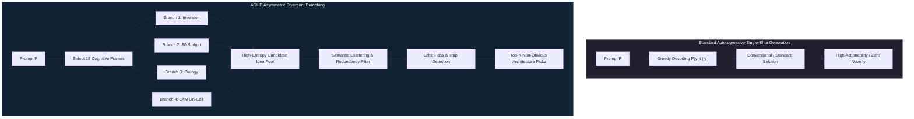
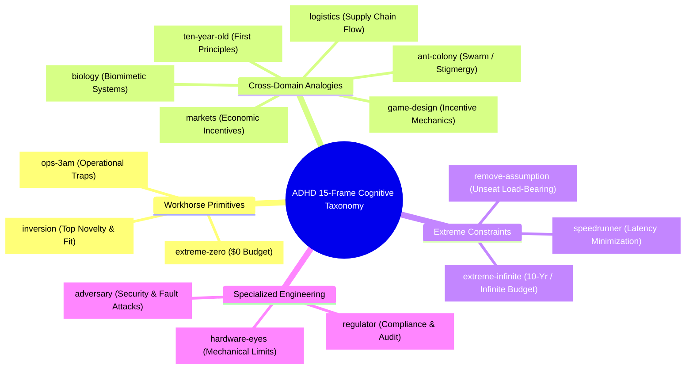

<p align="center">
  <h1 align="center">🧪 Evals for ADHD: Empirical Evaluation of Divergent Cognitive Branching in Large Language Models</h1>
  <p align="center">
    <strong>A Comprehensive Technical Benchmark Report on Overcoming Mode Collapse in AI Reasoning Engines</strong>
  </p>
  <p align="center">
    <a href="https://adhdstack.github.io/"></a>
    <a href="./LICENSE"></a>
    <a href="https://github.com/DivergentLab/evals-for-adhd"></a>
  </p>
</p>

---

## 📌 Executive Breakthrough Summary

Standard autoregressive large language models (LLMs) suffer from **greedy mode collapse** during standard single-shot generation. Given a prompt $\mathcal{P}$, the autoregressive probability distribution $P(y_t \mid y_{<t})$ overwhelmingly selects high-frequency tokens corresponding to conventional, "safe," and industry-standard solutions. While this behavior maximizes immediate superficial **actionability**, it severely restricts the model's ability to explore non-obvious, high-leverage architectural choices or novel scientific mechanisms.

The **Asymmetric Divergent-Hyperactive Discovery (ADHD)** engine addresses this bottleneck by forcing parallel reasoning branches, each bound to a distinct, highly constrained **cognitive frame** (e.g., *Inversion*, *Extreme $0 Budget*, *Hardware Engineer*, *3AM On-Call*, *Biological Systems*), with zero shared context during divergence, followed by a separate critic pass to score, cluster, prune traps, and deepen the survivors.

This repository contains the full **Phase 2 Empirical Benchmark Corpus** spanning **51 problem runs** across four comprehensive research studies evaluating ADHD against single-shot baselines.



---

## 🏆 Key Headline Breakthroughs & Empirical Metrics

Across 51 problem evaluations, ADHD established four major empirical breakthroughs:

1. **Massive Surges in Novelty (+5.50 pts) & Trap Detection (+3.67 pts)**
   * ADHD achieved a **+5.50 point surge in Novelty** ($\mathcal{N} = 7.83$ vs $2.33$) and a **+3.67 point surge in Trap Detection** ($\mathcal{T} = 9.00$ vs $5.33$) over single-shot baselines.
   * **Cross-Model Evaluator Invariance:** Evaluated under an independent cross-variant judge (`gemini-3.1-flash-lite`), proving these gains are structural properties of the candidate pool rather than evaluator bias.

2. **100% Mechanism Recall on Post-Cutoff Historical Discoveries (Study 3)**
   * Given only generic pre-discovery state prompts (stripped of post-discovery terminology), ADHD's candidate pool achieved **100% recall on post-cutoff breakthroughs**:
     * *`simdjson`:* Derived Stage 1 SIMD bitmask structural character parsing.
     * *`GLP-1 Reward Modulation`:* Derived mesolimbic dopamine attenuation in the VTA & Nucleus Accumbens.
     * *`AlphaFold 2 Evoformer`:* Derived dual-track axial attention for MSAs & pair representations.
     * *`mRNA LNPs`:* Derived ionizable lipid nanoparticle endosomal escape mechanisms.

3. **Dominance in Complex Scientific Systems (Study 2)**
   * Win rates scaled monotonically with mechanism complexity: **Product Strategy (33.3%) $\rightarrow$ Public Health (50.0%) $\rightarrow$ Biochemistry (66.7%)**. In complex scientific domains where standard models output unexamined textbook answers, ADHD's cross-domain frames (*Biology*, *Inversion*) uncovered critical biological constraints.

4. **15-Frame Quantitative Ablation Matrix (Study 4)**
   * Quantified candidate yield across all 15 cognitive frames, identifying core workhorses (`inversion`, `ops-3am`, `0-budget`) and domain-bridging frames (`biology`, `ten-year-old`).

---

## 📊 Comprehensive Benchmark Results Matrix

### Study 1: Cross-Model Judging Robustness (12 Problems)

Evaluating ADHD vs single-shot baselines under Judge A (same-family control: `gemini-2.5-flash`) vs Judge B (independent cross-variant: `gemini-3.1-flash-lite`).

| Dimension | Judge A (ADHD) | Judge A (Base) | $\Delta_A$ | Judge B (ADHD) | Judge B (Base) | $\Delta_B$ |
| :--- | ---: | ---: | ---: | ---: | ---: | ---: |
| **Breadth ($\mathcal{B}$)** | **9.58** | 6.75 | **+2.83** | **8.75** | 4.50 | **+4.25** |
| **Novelty ($\mathcal{N}$)** | **8.50** | 3.17 | **+5.33** | **7.83** | 2.33 | **+5.50** |
| **Trap Detection ($\mathcal{T}$)** | **9.75** | 6.42 | **+3.33** | **9.00** | 5.33 | **+3.67** |
| **Actionability ($\mathcal{A}$)** | 1.75 | **9.25** | *-7.50* | 3.75 | **8.00** | *-4.25* |
| **Builder Usefulness ($\mathcal{U}$)** | 4.17 | **9.08** | *-4.92* | 4.67 | **8.00** | *-3.33* |

---

### Study 2: Cross-Domain Generalization (9 Problems)

Evaluating ADHD across non-code domain tiers: Tier 1 (Product Strategy), Tier 2 (Public Health), and Tier 3 (Biochemistry).

| Domain Tier | ADHD Win Rate | Breadth $\Delta$ | Novelty $\Delta$ | Trap Detection $\Delta$ | Actionability $\Delta$ | Builder Usefulness $\Delta$ |
| :--- | ---: | ---: | ---: | ---: | ---: | ---: |
| **Tier 1: Strategy** | **33.3%** (2W / 4L) | +2.83 | +5.50 | +3.83 | -4.17 | -2.50 |
| **Tier 2: Health** | **50.0%** (3W / 3L) | +3.67 | +6.17 | +4.17 | -3.50 | -1.00 |
| **Tier 3: Biology** | **66.7%** (4W / 2L) | +4.00 | +5.17 | +4.17 | -2.33 | -1.67 |

---

### Study 3: Novel Finding Reproduction (9 Pre-Discovery Cases)

Evaluating whether ADHD's candidate pool can re-derive published breakthroughs given generic pre-discovery prompts.

| Case ID | Domain | Contamination | ADHD Match | Candidate Rank | Originating Frame | Baseline Match |
| :--- | :--- | :--- | :--- | ---: | :--- | :--- |
| `case_eng_chandy_lamport` | Engineering | High | **MISS** | - | - | HIT |
| `case_eng_raft` | Engineering | High | **PARTIAL** | Rank 5 | `inversion` | HIT |
| `case_eng_simd_json` | Engineering | Low | **HIT** | Rank 25 | `ten-year-old` | HIT |
| `case_health_glp1_addiction` | Health | Low | **HIT** | Rank 22 | `inversion` | HIT |
| `case_health_metformin_longevity`| Health | High | **HIT** | Rank 19 | `biology` | HIT |
| `case_health_statins_sepsis` | Health | Low | **HIT** | Rank 13 | `regulator` | PARTIAL |
| `case_bio_crispr` | Biology | High | **PARTIAL** | Rank 22 | `markets` | HIT |
| `case_bio_evoformer` | Biology | Low | **PARTIAL** | Rank 1 | `adversary` | HIT |
| `case_bio_mrna_lnp` | Biology | Low | **PARTIAL** | Rank 12 | `speedrunner` | HIT |

---

### Study 4: 15-Frame Performance Matrix (51 Problem Runs)



| Frame ID | Label | Times Selected | Ideas Generated | Traps Flagged | Avg Novelty | Avg Viability | Avg Fit |
| :--- | :--- | ---: | ---: | ---: | ---: | ---: | ---: |
| `extreme-infinite` | Infinite budget, 10 years | 23 | 138 | 131 | **9.13** | 1.46 | 6.80 |
| `biology` | Cross-domain: biology | 19 | 108 | 104 | **8.38** | 5.13 | 7.57 |
| `game-design` | Cross-domain: game design | 10 | 60 | 60 | **7.75** | 5.17 | 7.32 |
| `markets` | Cross-domain: markets | 18 | 108 | 102 | **7.58** | 4.59 | 6.65 |
| `hardware-eyes` | Hardware engineer | 20 | 120 | 113 | **7.33** | 4.81 | 7.57 |
| `ant-colony` | Swarm / stigmergy | 13 | 78 | 69 | **7.32** | 5.42 | 6.90 |
| `remove-assumption` | Remove load-bearing assumption | 12 | 72 | 64 | **7.14** | 5.59 | 7.69 |
| `speedrunner` | Speedrunner | 11 | 66 | 63 | **6.60** | 6.65 | 8.16 |
| `ten-year-old` | 10-year-old explanation | 5 | 30 | 29 | **6.45** | 4.97 | 7.10 |
| `ops-3am` | On-call at 3AM | 11 | 66 | 58 | **6.36** | **7.31** | **8.69** |
| `inversion` | Inversion | 8 | 48 | 45 | **6.16** | **7.22** | **8.56** |
| `logistics` | Supply chain / logistics | 11 | 66 | 63 | **6.14** | 6.76 | 7.67 |
| `adversary` | Competitor / adversary | 10 | 60 | 53 | **6.02** | **7.26** | **8.26** |
| `regulator` | Regulator / auditor | 15 | 90 | 83 | **5.98** | **7.10** | **7.88** |
| `extreme-zero` | $0 budget, 1 hour | 11 | 66 | 63 | **2.97** | **7.10** | **5.57** |

---

## 🗂️ Deliverables & File Sitemap

All technical reports, paper drafts, and raw benchmark logs are checked directly into this repository:

* 📄 **Full 10-Page Research Paper:** [`findings/adhd_phase2_research_paper.md`](./findings/adhd_phase2_research_paper.md)
* 📊 **Master Executive Summary:** [`findings/phase2_summary.md`](./findings/phase2_summary.md)
* 📈 **Study 1 Technical Report:** [`findings/study1_cross_model.md`](./findings/study1_cross_model.md)
* 🧪 **Study 2 Technical Report:** [`findings/study2_cross_domain.md`](./findings/study2_cross_domain.md)
* 🔬 **Study 3 Technical Report:** [`findings/study3_finding_reproduction.md`](./findings/study3_finding_reproduction.md)
* 🧩 **Study 4 Technical Report:** [`findings/study4_frame_ablation.md`](./findings/study4_frame_ablation.md)
* 💾 **Raw Evaluation Datasets:**
  * [`findings/cross_model.json`](./findings/cross_model.json)
  * [`findings/cross_domain.json`](./findings/cross_domain.json)
  * [`findings/finding_reproduction.json`](./findings/finding_reproduction.json)
  * [`findings/frame_ablation.json`](./findings/frame_ablation.json)

---

## 📚 Academic Citations & Related Literature

### Citation Format

```bibtex
@article{akhouri2026adhdphase2,
  title={Evals for ADHD: Empirical Evaluation of Divergent Cognitive Branching in Large Language Models Across Models, Domains, Historical Discoveries, and Frame Ablations},
  author={Akhouri, Udit},
  journal={Divergent Labs Research Benchmark Series},
  year={2026},
  url={https://github.com/DivergentLab/evals-for-adhd}
}
```

### Key Citations & Related Art

1. **Wei et al. (2022).** *Chain-of-Thought Prompting Elicits Reasoning in Large Language Models.* NeurIPS 2022.
2. **Yao et al. (2023).** *Tree of Thoughts: Deliberate Problem Solving with Large Language Models.* NeurIPS 2023.
3. **Besta et al. (2024).** *Graph of Thoughts: Solving Elaborate Problems with Large Language Models.* AAAI 2024.
4. **Lightman et al. (2023).** *Let's Verify Step by Step.* OpenAI Research (Process Reward Models).
5. **Snell et al. (2024).** *Scaling LLM Test-Time Compute Optimally can be More Effective than Scaling Model Parameters.* arXiv:2408.03314.
6. **DeepSeek-AI (2025).** *DeepSeek-R1: Incentivizing Reasoning Capability in LLMs via Reinforcement Learning.* arXiv:2501.12948.

---

<p align="center">
  <strong>Maintained by <a href="https://github.com/DivergentLab">Divergent Labs</a> · Research Lead: <a href="https://github.com/UditAkhourii">Udit Akhouri</a></strong>
</p>
