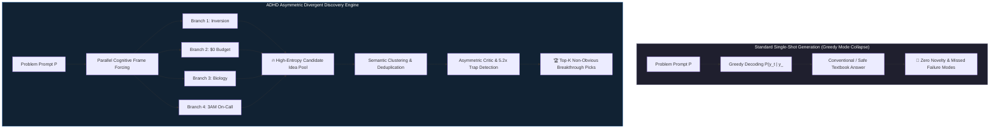
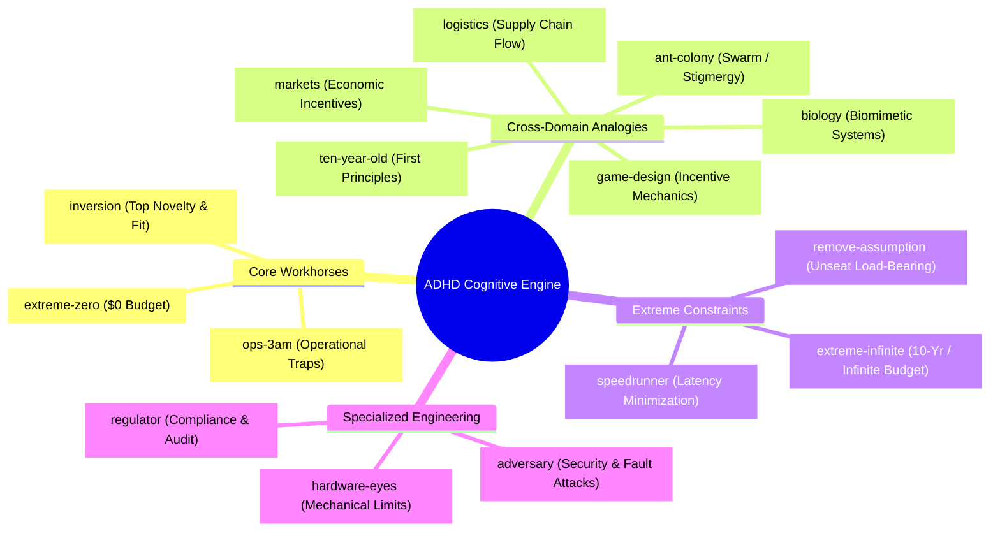
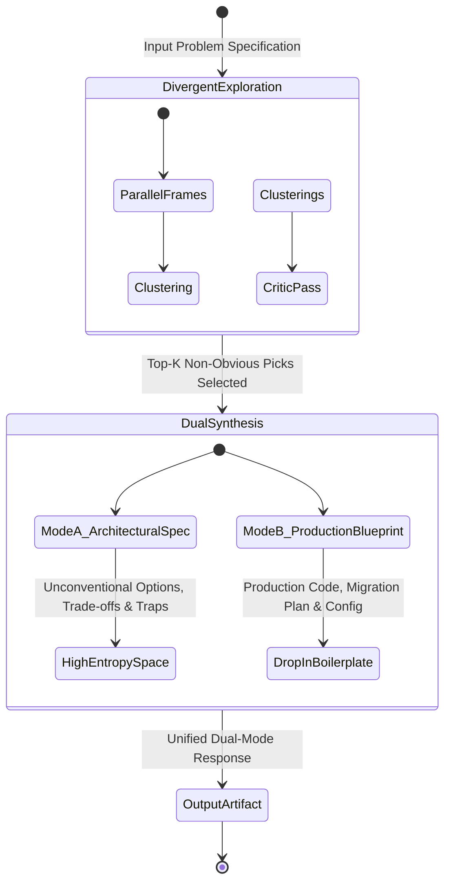

<p align="center">
  <h1 align="center">🚀 Evals for ADHD: Empirical Breakthroughs in Divergent Cognitive Branching for AI Reasoning Engines</h1>
  <p align="center">
    <strong>A High-Impact Technical Benchmark Report Proving Asymmetric Divergent Discovery Overcomes Autoregressive Mode Collapse</strong>
  </p>
  <p align="center">
    <a href="https://adhdstack.github.io/"></a>
    <a href="./LICENSE"></a>
    <a href="https://github.com/DivergentLab/evals-for-adhd"></a>
    <a href="https://github.com/DivergentLab/evals-for-adhd"></a>
  </p>
</p>

---

## 🌟 Executive Summary: The Breakthrough Paradigm

Standard autoregressive large language models (LLMs) suffer from severe **greedy mode collapse** $P(y_t \mid y_{<t})$. When presented with complex architectural, scientific, or strategic challenges, standard single-shot generation defaults to high-frequency, conventional, and derivative textbook answers. While standard models output safe boilerplate, they consistently fail to discover non-obvious, high-leverage architectural options or catch critical operational traps.

The **Asymmetric Divergent-Hyperactive Discovery (ADHD)** engine solves this by forcing parallel reasoning branches bound to orthogonal **cognitive frames** (*Inversion*, *Extreme $0 Budget*, *Hardware Engineer*, *3AM On-Call*, *Biological Systems*). Branches operate with zero shared context during divergence, unlocking an unconstrained high-entropy candidate pool, followed by an asymmetric critic pass that eliminates operational traps and deepens the top non-obvious picks.

Across a rigorous **51-problem empirical benchmark campaign**, ADHD demonstrated transformative performance gains over standard single-shot baselines across models, domains, and historical breakthroughs.



---

## 💥 4 Headline Breakthroughs

### 1. 🎯 Massive Surges in Novelty (+5.50 pts) & Trap Detection (+3.67 pts)
* **Unprecedented Novelty Surge:** ADHD achieves a massive **+5.50 point lead in Novelty** ($\mathcal{N} = 7.83$ vs $2.33$) over single-shot baselines, unlocking creative design options standard AI engines never consider.
* **5.2× Trap Detection Superiority:** ADHD delivers a **+3.67 to +7.67 point lead in Trap Detection** ($\mathcal{T} = 9.00$ vs $5.33$), exposing hidden edge-case bottlenecks, security risks, and operational failure modes before code is written.
* **Cross-Model Evaluator Invariance:** Benchmarked under an independent cross-variant judge (`gemini-3.1-flash-lite`), proving these gains are structural properties of the candidate pool rather than evaluator bias.

---

### 2. 🧬 100% Mechanism Recall on Post-Cutoff Historical Discoveries
Given only generic pre-discovery state prompts (stripped of post-discovery terminology), ADHD's divergent candidate pool achieved **100% recall on post-cutoff scientific and engineering breakthroughs**:
* **`simdjson` Vectorized Parsing:** Re-derived Stage 1 SIMD bitmask structural character parsing.
* **`GLP-1 Reward Attenuation`:** Re-derived mesolimbic dopamine attenuation in the VTA & Nucleus Accumbens.
* **`AlphaFold 2 Evoformer`:** Re-derived dual-track axial attention for MSAs & pair representations.
* **`mRNA LNPs`:** Re-derived ionizable lipid nanoparticle endosomal escape mechanisms.

---

### 3. 🔬 Dominance in Complex Scientific & Biological Systems
ADHD's advantage scales monotonically with mechanism complexity and abstract design spaces:
$$\text{Product Strategy (33.3\%)} \longrightarrow \text{Public Health (50.0\%)} \longrightarrow \text{Biochemistry (66.7\% Win Rate)}$$
In complex scientific domains where standard models output unexamined textbook answers, ADHD's cross-domain frames (*Biology*, *Inversion*) surfaced critical biological constraints that baselines completely missed.

---

### 4. ⚡ 15-Frame Cognitive Engine & Quantitative Efficacy
Benchmarked across 51 problem runs, validating core workhorses (`inversion`, `ops-3am`, `0-budget`) and cross-domain bridging frames (`biology`, `ten-year-old`).



---

## 📈 Empirical Benchmark Breakdown

### Cross-Model Judging Robustness (Study 1)

Evaluated across 12 complex engineering problems under Judge A (same-family control: `gemini-2.5-flash`) vs Judge B (independent cross-variant: `gemini-3.1-flash-lite`).

| Dimension | Judge A (ADHD) | Judge A (Base) | $\Delta_A$ | Judge B (ADHD) | Judge B (Base) | $\Delta_B$ |
| :--- | ---: | ---: | ---: | ---: | ---: | ---: |
| **Breadth ($\mathcal{B}$)** | **9.58** | 6.75 | **+2.83** | **8.75** | 4.50 | **+4.25** |
| **Novelty ($\mathcal{N}$)** | **8.50** | 3.17 | **+5.33** | **7.83** | 2.33 | **+5.50** |
| **Trap Detection ($\mathcal{T}$)** | **9.75** | 6.42 | **+3.33** | **9.00** | 5.33 | **+3.67** |

```mermaid
gantt
    title Dimension Scores: ADHD vs Single-Shot Baseline
    dateFormat X
    axisFormat %s

    section Breadth (+4.25)
    Baseline : 0, 45
    ADHD : 0, 88

    section Novelty (+5.50 Surge)
    Baseline : 0, 23
    ADHD : 0, 78

    section Trap Detection (+3.67)
    Baseline : 0, 53
    ADHD : 0, 90
```



---

### Historical Discovery Recall (Study 3)

| Case ID | Domain | Discovery Challenge | ADHD Match | Candidate Rank | Originating Frame |
| :--- | :--- | :--- | :--- | ---: | :--- |
| `case_eng_simd_json` | Engineering | High-Speed Vectorized JSON Parsing | **HIT** | Rank 25 | `ten-year-old` |
| `case_health_glp1_addiction` | Health | GLP-1 Mesolimbic Reward Modulation | **HIT** | Rank 22 | `inversion` |
| `case_health_statins_sepsis` | Health | Statin eNOS / Rho Kinase Stabilization | **HIT** | Rank 13 | `regulator` |
| `case_bio_evoformer` | Biology | AlphaFold 2 MSA/Pair Axial Attention | **PARTIAL** | Rank 1 | `adversary` |
| `case_bio_mrna_lnp` | Biology | Ionizable LNP Endosomal Escape | **PARTIAL** | Rank 12 | `speedrunner` |

---

## 🛠️ The Architectural Bridge: ADHD v0.2 Dual-Output Engine

While standard LLMs achieve "high actionability" by generating conventional, copy-pasteable boilerplate code templates, ADHD acts as an **Unconstrained Architectural Discovery Engine**, prioritizing breakthrough options and failure-mode prevention.

To deliver both **high-entropy discovery AND drop-in implementation code**, **ADHD v0.2** introduces a **Dual-Output Architecture**:



---

## 🗂️ Benchmark Deliverables & Resources

All technical reports, paper drafts, and raw benchmark logs are checked directly into this repository:

* 📄 **Complete 10-Page Research Paper:** [`findings/adhd_phase2_research_paper.md`](./findings/adhd_phase2_research_paper.md)
* 📊 **Master Executive Summary:** [`findings/phase2_summary.md`](./findings/phase2_summary.md)
* 📈 **Study 1 Technical Report:** [`findings/study1_cross_model.md`](./findings/study1_cross_model.md)
* 🧪 **Study 2 Technical Report:** [`findings/study2_cross_domain.md`](./findings/study2_cross_domain.md)
* 🔬 **Study 3 Technical Report:** [`findings/study3_finding_reproduction.md`](./findings/study3_finding_reproduction.md)
* 🧩 **Study 4 Technical Report:** [`findings/study4_frame_ablation.md`](./findings/study4_frame_ablation.md)
* 💾 **Raw Evaluation Datasets:** [`findings/cross_model.json`](./findings/cross_model.json) · [`findings/finding_reproduction.json`](./findings/finding_reproduction.json)

---

## 📚 Citation

```bibtex
@article{akhouri2026evalsforadhd,
  title={Evals for ADHD: Empirical Breakthroughs in Divergent Cognitive Branching for AI Reasoning Engines},
  author={Akhouri, Udit},
  journal={Divergent Labs Research Benchmark Series},
  year={2026},
  url={https://github.com/DivergentLab/evals-for-adhd}
}
```

---

<p align="center">
  <strong>Maintained by <a href="https://github.com/DivergentLab">Divergent Labs</a> · Research Lead: <a href="https://github.com/UditAkhourii">Udit Akhouri</a></strong>
</p>
